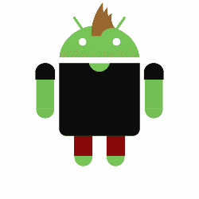
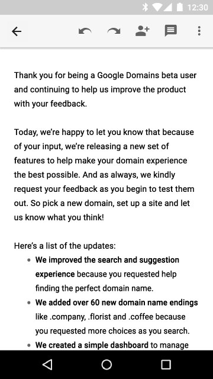

class: center, middle, inverse
# Initiation Mobile Java/Android
## CRM15

---
class: center, middle, inverse
# Présentez-vous !

---
.left-column[
## Louis Beltramo
### - SRC Montbéliard / Gobelins Annecy
### - Freelance / Oz Conseil
### - Développeur mobile, web & interactif
]

.right-column[
.pull-left[
### Un soupçon de desktop
- C
- Java
- AS3/Air
- Haxe/NME/OpenFL
- NW.js

### Un peu de back
- Node.js/Hapi
- Ruby/Rails
- PHP/Wordpress/Drupal

### Du mobile
- AS3/Air
- Haxe/NME/OpenFL
- Java/Android
- JS/Cordova
]

### Quelques plateformes
- Android
- Arduino
- Blackberry
- Firefox OS
- GNU/Linux
- Ti 83
- iOS
- Matchstick
- Raspberry Pi
- Tizen (IVI)
- Web
- Windows
]

---
class: center, middle, inverse
# Modalités

---
.left-column[
## Modalités
### - Rendu
]

.right-column[
# .center[Lundi 15 février 2016 à 23h59]
]
---

.left-column[
## Modalités
### - Rendu
### - Rendu intermédiaire
]

.right-column[
# .center[Vendredi 5 février 2016 à 16h30]
]
---

.left-column[
## Modalités
### - Rendu
### - Livrables
]

.right-column[
### Claroline
- Zip des sources
- Apk de l'appli
- Vidéos / captures d'écrans
- README.md / Document d'info sur votre projet
  - Lien vers le dépôt Git

### Dépôt Git
- Projet complet versionné
- Historique des commits reflétant tout votre travail
- README.md _le document d'info complet_
]
---

.left-column[
## Modalités
### - Rendu
### - Livrables
### - Barême
]

.right-column[
## Ce qui rentre dans les critères d’évaluation :
- Projet complet et fonctionnel : __5 points__
- Qualité du travail :            __5 points__
- Maîtrise des concepts Java :    __3 points__
- Maîtrise des concepts Android : __3 points__
- Ergonomie :                     __2 points__
- Qualité du code source :        __1 point__
- Gestion du projet :             __1 point__

## Ce qui ne rentre pas dans les critères d’évaluation :
- le graphisme
- les bugs mineurs
]
---

.left-column[
## Modalités
### - Rendu
### - Planning
]

.right-column[
# Jeudi 21 janvier
## matin
- Un peu de théorie
- Prise en main d'Android Studio
- Devices et émulateurs
- Hello World

## après-midi
- Architecture et composants Android
  - Manifest
  - Activity et explicit Intents
  - Layouts
  - Fragments
  - Ressources
  - Adapter et ListView
]

---
.left-column[
## Modalités
### - Rendu
### - Planning
]

.right-column[
# Vendredi 22 janvier
## après-midi
- Google Play Services
- Géolocation
- Firebase
]

---
.left-column[
## Modalités
### - Rendu
### - Planning
]

.right-column[
# Jeudi 4 février
## matin
- Geofire
- Mapbox

## après-midi
- Projet
]

---
.left-column[
## Modalités
### - Rendu
### - Planning
]

.right-column[
# Vendredi 5 février
## matin
- Material design

## après-midi
- Projet
]

---
.left-column[
## Modalités
### - Rendu
### - Planning
]

.right-column[
# Lundi 15 février
## matin
- Projet
]

---
class: center, middle, inverse
# Android

---
.left-column[
## Android
### - Android, Inc
]

.right-column[
## Fondé en Octobre 2003
- concurrencer Symbian (!) et Windows Mobile (!)
- le but : "smarter mobile devices that are more aware of its owner's location and preferences"
<br />
<br />
.pull-left[]
]

.footnote[Pour info en 2002 on vendait encore des Nokia 3310]

---
.left-column[
## Android
### - Android, Inc
### - Google
]

.right-column[
## Racheté par Google en Août 2005
- Travail sur une platforme mobile basée sur le noyau Linux
- Protoype proche d'un blackberry
<br/>
<br/>
.pull-left[]
]

---
.left-column[
## Android
### - Android, Inc
### - Google
### - Touchscreen
]

.right-column[
## iPhone sort en 2007
- Pas de clavier physique !
- Google se dépêche d'ajouter un touchscreen mais garde le clavier physique.

## HTC Dream (G1) sort en 2008
<br/>
<br/>
.pull-left[]
]

---
.left-column[
## Android
### - Android, Inc
### - Google
### - Touchscreen
### - Nexus
]

.right-column[
## Nexus One en 2010 / Android Eclair 2.1
.pull-left[]
]

---
.left-column[
## Android
### - Android, Inc
### - Google
### - Touchscreen
### - Nexus
### - Versions
]

.right-column[
## D'android Alpha à Android Marshmallow
.center[]
https://en.wikipedia.org/wiki/Android_version_history
]

---
.left-column[
## Android
### - Android, Inc
### - Google
### - Touchscreen
### - Nexus
### - Versions
### - AOSP
]

.right-column[
# Android Open Source Project
- Couche propriétaire Google
- De nombreuses applis AOSP sont abandonnées

## Plusieurs Android
- Cyanogen
- Replicant

## Des morceaux d'Android ailleurs
- Firefox OS
- Jolla Sailfish OS
]

---
class: center, middle, inverse
# Android 5


---
.left-column[
## Android 5
]
<br/>
<br/>
<br/>
.center[

]

---
.left-column[
## Android 5
### - Material Design
]

.center[
<video autoplay="true" loop="true">
    <source src="https://developer.android.com/design/material/videos/ContactsAnim.mp4" />
</video>
]

.footnote[[->Intro material design](http://www.google.com/design/spec/material-design/introduction.html)]

---
.left-column[
## Android 5
### - Material Design
### - Nouveautés
]
.right-column[
.pull-right[]
## Notifications
## Project Volta
## ART
- Remplace Dalvik
- AOT au lieu de JIT

]

???
__ART__ Ahead-of-time (AOT) compilation

---
.left-column[
## Android 5
### - Material Design
### - Nouveautés
### - Android Wear
]

.right-column[
.pull-right[]
## Mobile & Wear
- Applis "déportés"
]

---
.left-column[
## Android 5
### - Material Design
### - Nouveautés
### - Android Wear
### - Android TV
]

.pull-left[]

---
.left-column[
## Android 5
### - Material Design
### - Nouveautés
### - Android Wear
### - Android TV
### - Android Auto
]

.pull-left[]

---
.left-column[
## Android 5
### - Material Design
### - Nouveautés
### - Android Wear
### - Android TV
### - Android Auto
### - OK Google
]

.pull-left[]

---
class: center, middle, inverse
# Android 6

---
.left-column[
## Android M
### - Permissions
]
## Runtime Permissions

---

## Runtime Permissions
```java
if (ContextCompat.checkSelfPermission(this, Manifest.permission.READ_CONTACTS)
        != PackageManager.PERMISSION_GRANTED) {
    if (ActivityCompat.shouldShowRequestPermissionRationale(thisActivity,
            Manifest.permission.READ_CONTACTS)) {
        // L'utilisateur a déjà refusé la permission
        // Essayer d'être convaincant
    } else {
        ActivityCompat.requestPermissions(this,
                new String[]{Manifest.permission.READ_CONTACTS},
                MY_PERMISSIONS_REQUEST_READ_CONTACTS);

    }
}
```
---

## Runtime Permissions
```java
@Override
public void onRequestPermissionsResult(int requestCode,
        String permissions[], int[] grantResults) {
    switch (requestCode) {
        case MY_PERMISSIONS_REQUEST_READ_CONTACTS: {
            if (grantResults.length > 0
                && grantResults[0] == PackageManager.PERMISSION_GRANTED) {
                // Permission accordée
            } else {
                // Permission refusée
            }
            return;
        }
    }
}
```
---

.left-column[
## Android M
### - Permissions
### - Power saving
]
.right-column[
## Doze mode

## App Standby
- Réseau une fois par jour
- Utilisation de GCM (connexion partagée)
]
---

.left-column[
## Android M
### - Permissions
### - Power saving
### - Text selection
]
.right-column[

]
---

.left-column[
## Android M
### - Permissions
### - Power Saving
### - Text Selection
### - Fingerprint
]
.right-column[

]
---

.left-column[
## Android M
### - Permissions
### - Power Saving
### - Text Selection
### - Fingerprint
### - Voice Actions
]
.right-column[

]
---

.left-column[
## Android M
### - Permissions
### - Power Saving
### - Text Selection
### - Fingerprint
### - Voice Actions
### - Divers
]
.right-column[
## Auto Backup
## App links
## Toujours plus de Play Services
]
---

class: center, middle, inverse
# Android Studio

---
.left-column[
## Android Studio
### - ADT ?
]

.right-column[
## ADT
- Eclipse
- Ant
- Abandonné par Google

## Android Studio
- IntelliJ Idea
- Gradle
- IDE officiel pour Android
]
.right[]

---
.left-column[
## Android Studio
### - ADT ?
### - Gradle
]

.right-column[
.pull-right[]
## Automate everything
- Gestion des assets
- Gestion des librairies
- Compilation
- Build de l'APK
- Signature
- ...

## Groovy
- Langage dynamique pour la JVM

```groovy
def commitHg(message) {
    def stdout = new ByteArrayOutputStream()
    exec {
        commandLine "hg", "commit", "-A", "-m", message
        standardOutput = stdout
    }
    println stdout.toString()
}

```

.footnote[Ex: Grunt, Gulp, Robo, Rake, Leinigen...]
]

???


---
.left-column[
## Android Studio
### - ADT ?
### - Gradle
### - Maven
]

.right-column[
## Dépôt centralisé

```groovy
import java.util.regex.Pattern

apply plugin: 'com.android.application'

repositories {
    mavenCentral()
}
```

## Gestionnaire de dépendances
```groovy
    compile 'com.doomonafireball.betterpickers:library:1.5.+'
    compile 'com.android.support:support-v4:20.0.+'
    compile 'com.google.android.gms:play-services:4.4.+'
```
]

???

- Gestionnaire de dépendance (entre autres)
- PHP : Composer
- JS : NPM / bower
- Ruby : Gem / bundler

---
class: center, middle, inverse
# Git

---
.left-column[
## Git
### - Github.com
### - Bitbucket.org
### - Gitlab.com
]

.right-column[
## Pour visualiser tout ça
- https://windows.github.com/
- https://mac.github.com/
- http://www.sourcetreeapp.com/
- https://github.com/FredrikNoren/ungit
- Gitg sous Linux
]
---

class: center, middle, inverse
# http://guides.codepath.com/android
---

class: center, middle, inverse
# Direction Android Studio !
